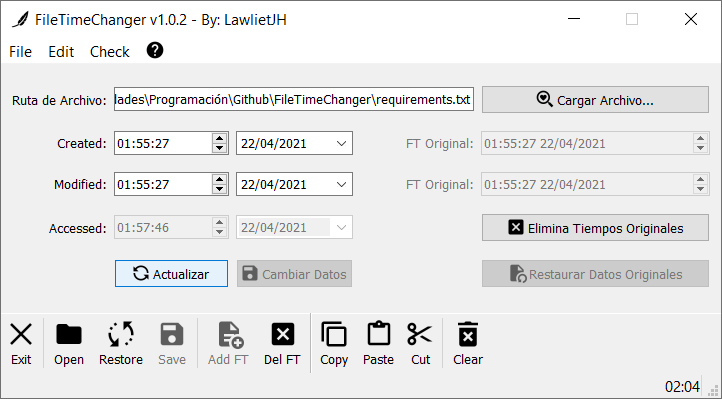

# FileTimeChanger
 Permite modificar los tiempos de Creación, Acceso y/o Modificación a cualquier archivo en Windows
# Versión 1.0.2
# Probado en Python 3.8.8 - Windows
# Requisitos: PyQT5 y pywin32
Comando: python -m pip install -r requirements.txt

# Ejemplos:
Al Cargar un archivo podremos ver lo siguiente:
Nota: Por defecto se añadirá un archivo de flujo de datos alternativo con nombre 'FTC' (archivo.ext:FTC), el cual contiene registro de los datos actuales/originales del archivo, sobre los datos de creación, modificación y último acceso del archivo. Se puede eliminar dicha información si se presiona el botón 'Eliminar Tiempos Originales'. Si se desea acceder al archivo alterno se puede desde una consola de comandos con el comando "notepad archivo.extension:FTC".

Al modificar por ejemplo las fechas, se habilitará la opción de "Cambiar Datos" lo cual modificará los tiempos de Creación, Modificación y Último Acceso al archivo.

Al presionar en 'Cambiar Datos' podremos ver ya reflejados los cambios en el archivo con las nuevas fechas. Se habilitará la opción de restaurar los datos originales, los cuales son obtenibles desde el archivo de flujo alternativo ':FTC'. Si el archivo de flujo alterno no existe, no será posible volver a cargar los datos originales del archivo.

Si presionamos el botón de 'Restaurar Datos Originales' se restaurarán los datos directamente.

Podemos ver los cambios reflejados y la opción de 'Restaurar Datos Originales' y los campos 'FT Original' (FileTime Original) se deshabilitarán, indicando que el archivo tiene ya sus datos originales.

Si presionamos el botón de 'Actualizar' esta opción nos permitirá cargar en los campos la fecha y hora actuales en todos los campos.

Al presionar 'Cambiar Datos' guardará los nuevos datos para el archivo.

Así mismo, podremos volver a ver los cambios reflejados.

