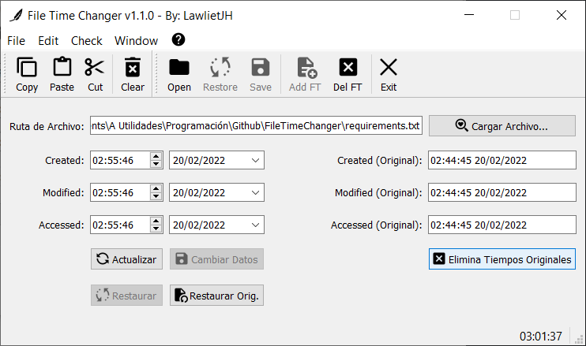

# FileTimeChanger
 Permite modificar los tiempos de Creación, Acceso y/o Modificación a cualquier archivo en Windows permitiendo colocar cualquier fecha Pasada o Futura (dentro de las limitaciones del sistema) con la finalidad de poder manipular las fechas de archivos.
# Versión 1.1.0
# Probado en Python 3.8.8 - Windows
# Requisitos: PyQT5 y pywin32
Comando: python -m pip install -r requirements.txt

# Ejemplos:
Al Cargar un archivo podremos ver lo siguiente:
Nota: Por defecto se añadirá un archivo de flujo de datos alternativo con nombre 'FTC' (archivo.ext:FTC), el cual contiene registro de los datos actuales/originales del archivo, sobre los datos de creación, modificación y último acceso del archivo. Se puede eliminar dicha información si se presiona el botón 'Eliminar Tiempos Originales'. Si se desea acceder al archivo alterno se puede desde una consola de comandos con el comando "notepad archivo.extension:FTC".

Al modificar por ejemplo las fechas, se habilitará la opción de "Cambiar Datos" lo cual modificará los tiempos de Creación, Modificación y Último Acceso al archivo.

Al presionar en 'Cambiar Datos' podremos ver ya reflejados los cambios en el archivo con las nuevas fechas. Se habilitará la opción de restaurar los datos originales, los cuales son obtenibles desde el archivo de flujo alternativo ':FTC'. Si el archivo de flujo alterno no existe, no será posible volver a cargar los datos originales del archivo.

Si presionamos el botón de 'Restaurar Datos Originales' se restaurarán los datos directamente.

Podemos ver los cambios reflejados y la opción de 'Restaurar Datos Originales' y los campos 'FT Original' (FileTime Original) se deshabilitarán, indicando que el archivo tiene ya sus datos originales.

Si presionamos el botón de 'Actualizar' esta opción nos permitirá cargar en los campos la fecha y hora actuales en todos los campos.

Al presionar 'Cambiar Datos' guardará los nuevos datos para el archivo.

Así mismo, podremos volver a ver los cambios reflejados.

Podemos restaurar los valores con los tiempos actuales del archivo.

Podremos volver a ver los cambios reflejados.

También podemos eliminar el archivo que almacena los tiempos originales.

Una vez realizado los campos de los tiempos originales serás deshabilitados.

Es posible añadir nuevos tiempos originales utilizando la opción "Add FT". Esto colocará los tiempos actuales del archivo ahora como los nuevos tiempos originales.

Ahora veremos los nuevos tiempos originales añadidos en los campos.

Otra posible opción disponible es la de El historial de Archivos Recientes el cual al seleccionar un nombre de archivo será recargado inmediatamente.

Es posble cambiar el tamaño de la ventana utilizando las opciones de la pestaña "Window" en su apartado "Resize". También es posible Centrar la Ventana en la pantalla utilizando el apartado "Center".

En la pestaña "Check" es posible observar checkbox con opciones para los "Toolbars". Con "Floating" se podrá "habilitar/deshabilitar" el que el Toolbar pueda ser Flotante. Con "Show Names" es posible "Mostrar/Ocultar" los nombres de los botones en estas. Con "Visible" es posible "Mostrar/Ocultar" las Toolbars.

En este ejemplo se muestra que los toolbars en estado "Flotante" pueden moverse a distintas partes de la ventana (arriba, abajo, izquierda o derecha) siempre y cuando el tamaño de la ventana lo permita, de no ser posible colocar alguno en uno de los lados, hacer la ventana un poco más grande deberá permitirlo.

Así mismo, es posible sacar los Toolbars de la ventana y dejarlos fijo o flotante fuera de esta.

En la pestaña "Edit" será posible apreciar 4 apartados: "Copy" que permite Copiar la ruta completa de un archivo cargado, "Paste" que permite pegar una ruta copiada (que sea valida) y cargar inmediatamente dicho archivo, "Cut" que corta la ruta cargada y limpia el campo, cerrando así el fichero anteriormente cargado y por último, "Clear" que limpia el campo, cerrando el archivo.

Imagen de muestra.

